Gitian building
================

*Setup instructions for a Gitian build of ALTEX Core using a Debian VM or physical system.*

Gitian is the deterministic build process that is used to build the ALTEX
Core executables. It provides a way to be reasonably sure that the
executables are really built from the source on GitHub. It also makes sure that
the same, tested dependencies are used and statically built into the executable.

Multiple developers build the source code by following a specific descriptor
("recipe"), cryptographically sign the result, and upload the resulting signature.
These results are compared and only if they match, the build is accepted and uploaded
to altex.org.

More independent Gitian builders are needed, which is why this guide exists.
It is preferred you follow these steps yourself instead of using someone else's
VM image to avoid 'contaminating' the build.

Table of Contents
------------------

- [Create a new VirtualBox VM](#create-a-new-virtualbox-vm)
- [Connecting to the VM](#connecting-to-the-vm)
- [Setting up Debian for Gitian building](#setting-up-debian-for-gitian-building)
- [Installing Gitian](#installing-gitian)
- [Setting up the Gitian image](#setting-up-the-gitian-image)
- [Getting and building the inputs](#getting-and-building-the-inputs)
- [Building ALTEX Core](#building-altex-core)
- [Building an alternative repository](#building-an-alternative-repository)
- [Signing externally](#signing-externally)
- [Uploading signatures](#uploading-signatures)

Preparing the Gitian builder host
---------------------------------

The first step is to prepare the host environment that will be used to perform the Gitian builds.
This guide explains how to set up the environment, and how to start the builds.

Debian Linux was chosen as the host distribution because it has a lightweight install (in contrast to Ubuntu) and is readily available.
Any kind of virtualization can be used, for example:
- [VirtualBox](https://www.virtualbox.org/) (covered by this guide)
- [KVM](http://www.linux-kvm.org/page/Main_Page)
- [LXC](https://linuxcontainers.org/), see also [Gitian host docker container](https://github.com/gdm85/tenku/tree/master/docker/gitian-bitcoin-host/README.md).

You can also install Gitian on actual hardware instead of using virtualization.

Create a new VirtualBox VM
---------------------------
In the VirtualBox GUI click "New" and choose the following parameters in the wizard:


- Type: Linux, Debian (64-bit)


- Memory Size: at least 3000MB, anything less and the build might not complete.

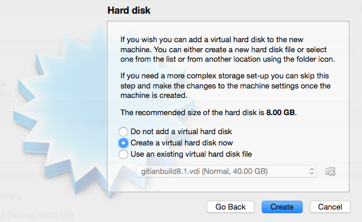

- Hard Disk: Create a virtual hard disk now

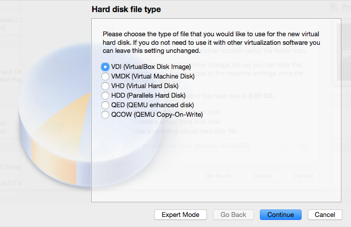

- Hard Disk file type: Use the default, VDI (VirtualBox Disk Image)


- Storage on physical hard disk: Dynamically Allocated


- File location and size: at least 40GB; as low as 20GB *may* be possible, but better to err on the safe side
- Click `Create`

After creating the VM, we need to configure it.

- Click the `Settings` button, then go to the `Network` tab. Adapter 1 should be attached to `NAT`.

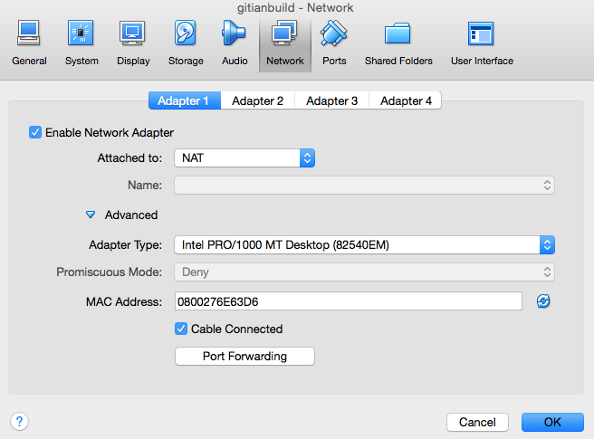

- Click `Advanced`, then `Port Forwarding`. We want to set up a port through which we can reach the VM to get files in and out.
- Create a new rule by clicking the plus icon.


- Set up the new rule the following way:
  - Name: `SSH`
  - Protocol: `TCP`
  - Leave Host IP empty
  - Host Port: `22222`
  - Leave Guest IP empty
  - Guest Port: `22`

- Click `Ok` twice to save.

Get the [Debian 8.x net installer](http://cdimage.debian.org/mirror/cdimage/archive/8.5.0/amd64/iso-cd/debian-8.5.0-amd64-netinst.iso) (a more recent minor version should also work, see also [Debian Network installation](https://www.debian.org/CD/netinst/)).
This DVD image can be [validated](https://www.debian.org/CD/verify) using a SHA256 hashing tool, for example on
Unixy OSes by entering the following in a terminal:

    echo "ad4e8c27c561ad8248d5ebc1d36eb172f884057bfeb2c22ead823f59fa8c3dff  debian-8.5.0-amd64-netinst.iso" | sha256sum -c
    # (must return OK)

Then start the VM. On the first launch you will be asked for a CD or DVD image. Choose the downloaded ISO.


Installing Debian
------------------

This section will explain how to install Debian on the newly created VM.

- Choose the non-graphical installer.  We do not need the graphical environment; it will only increase installation time and disk usage.

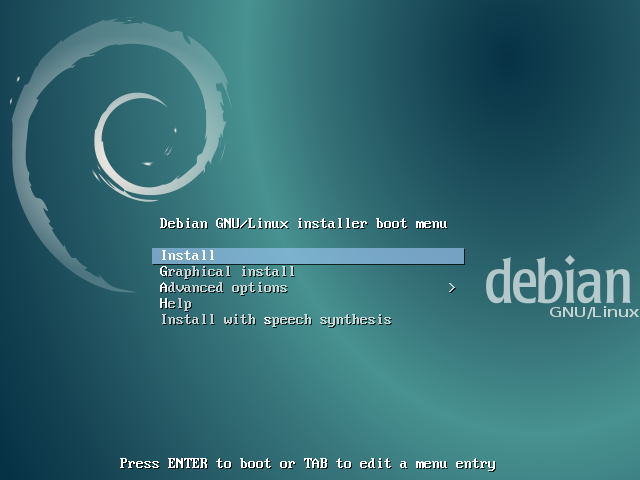

**Note**: Navigating in the Debian installer:
To keep a setting at the default and proceed, just press `Enter`.
To select a different button, press `Tab`.

- Choose locale and keyboard settings (doesn't matter, you can just go with the defaults or select your own information)


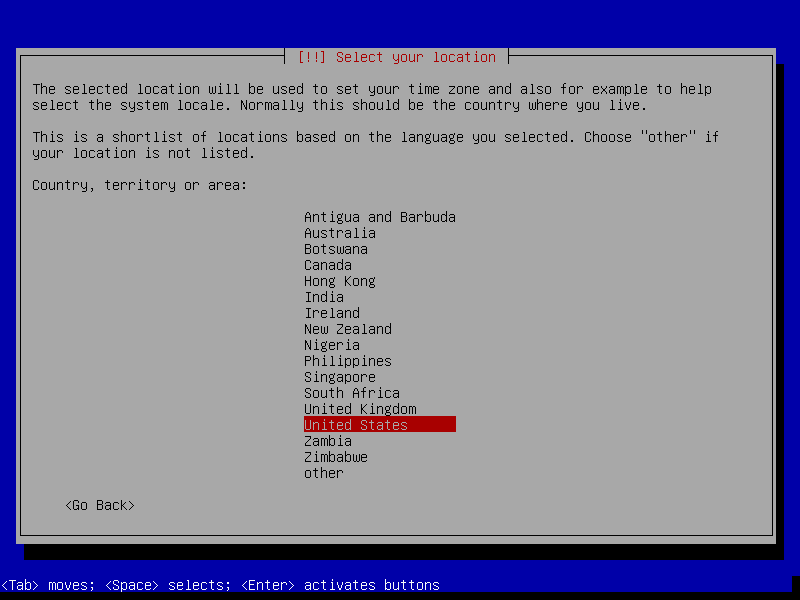


- The VM will detect network settings using DHCP, this should all proceed automatically
- Configure the network:
  - Hostname `debian`.
  - Leave domain name empty.


- Choose a root password and enter it twice (remember it for later)


- Name the new user `debian` (the full name doesn't matter, you can leave it empty)
- Set the account username as `debian`


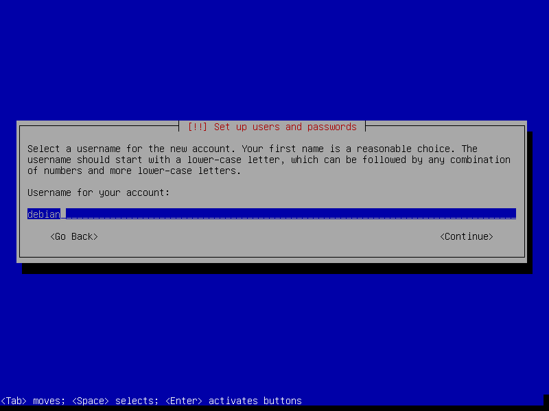

- Choose a user password and enter it twice (remember it for later)

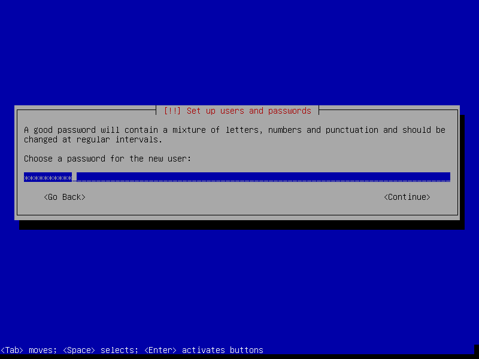

- The installer will set up the clock using a time server; this process should be automatic
- Set up the clock: choose a time zone (depends on the locale settings that you picked earlier; specifics don't matter)  


- Disk setup
  - Partitioning method: Guided - Use the entire disk

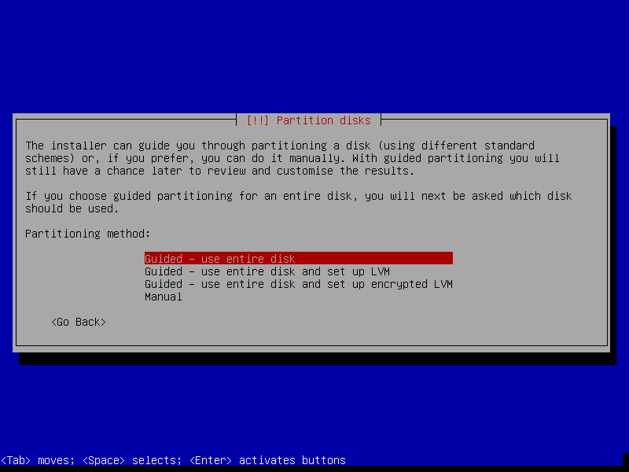

  - Select disk to partition: SCSI1 (0,0,0)

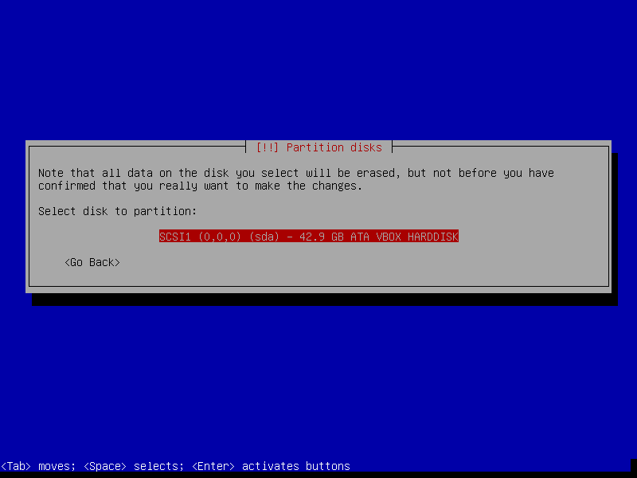

  - Partition Disks -> *All files in one partition*

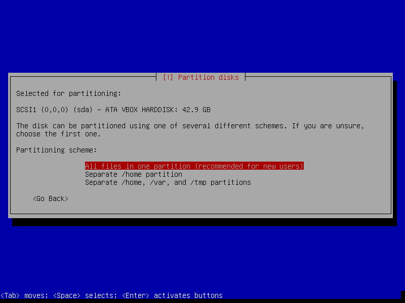

  - Finish partitioning and write changes to disk -> *Yes* (`Tab`, `Enter` to select the `Yes` button)

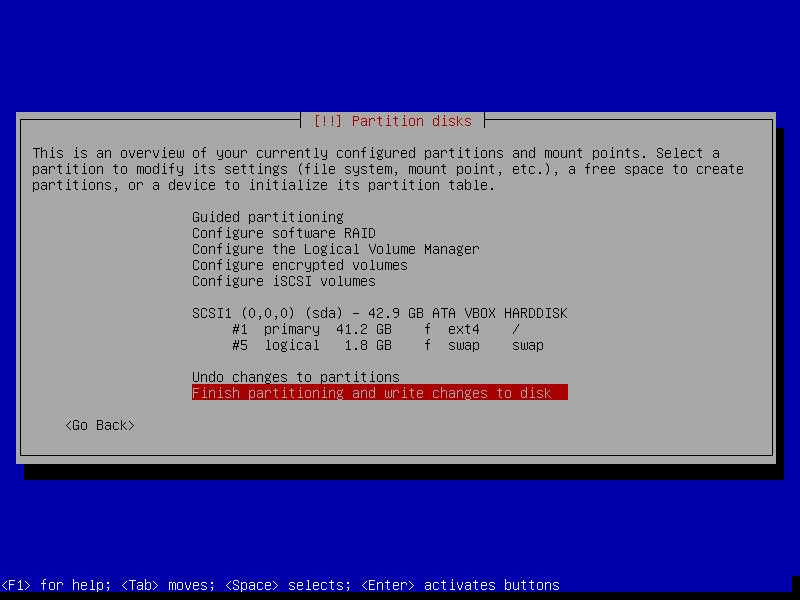


- The base system will be installed, this will take a minute or so
- Choose a mirror (any will do)

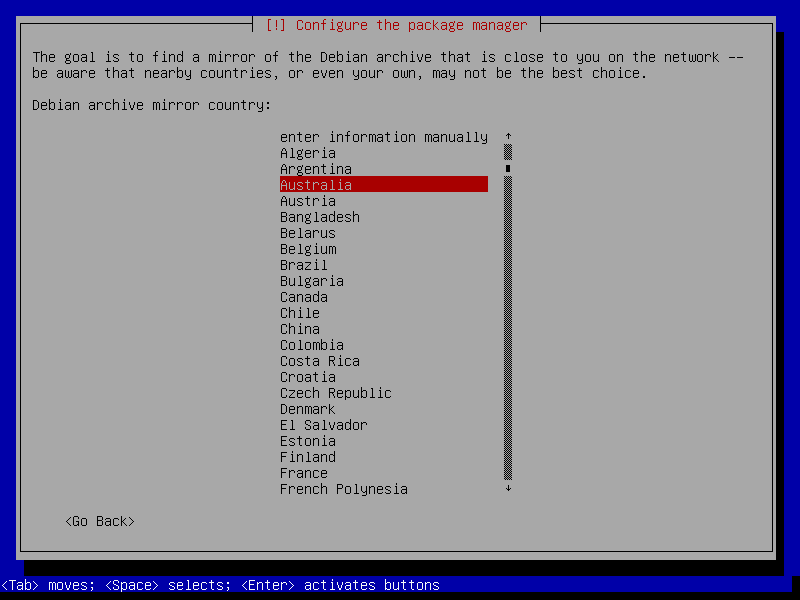

- Enter proxy information (unless you are on an intranet, leave this empty)


- Wait a bit while 'Select and install software' runs
- Participate in popularity contest -> *No*
- Choose software to install. We need just the base system.
- Make sure only 'SSH server' and 'Standard System Utilities' are checked
- Uncheck 'Debian Desktop Environment' and 'Print Server'

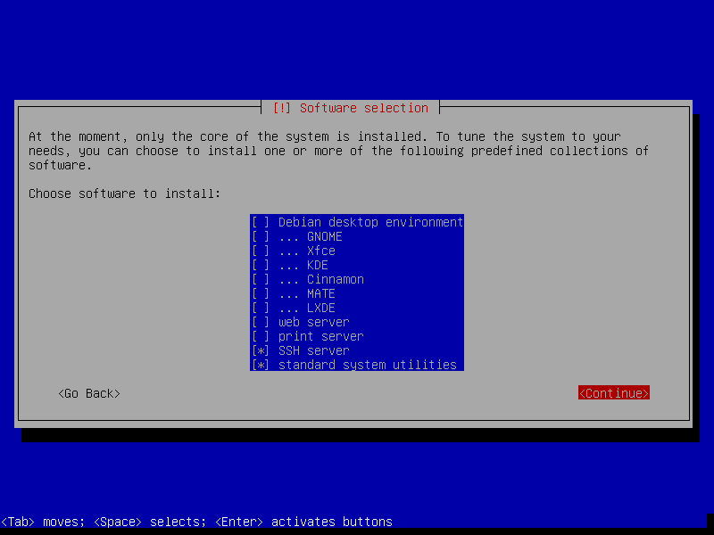

- Install the GRUB boot loader to the master boot record? -> Yes

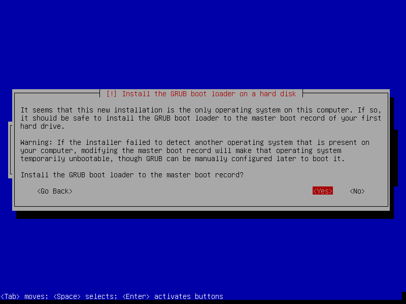

- Device for boot loader installation -> ata-VBOX_HARDDISK


- Installation Complete -> *Continue*
- After installation, the VM will reboot and you will have a working Debian VM. Congratulations!


After Installation
-------------------
The next step in the guide involves logging in as root via SSH.
SSH login for root users is disabled by default, so we'll enable that now.

Login to the VM using username `root` and the root password you chose earlier.
You'll be presented with a screen similar to this.

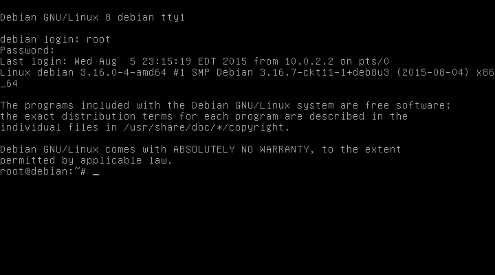

Type:

```
sed -i 's/^PermitRootLogin.*/PermitRootLogin yes/' /etc/ssh/sshd_config
```
and press enter. Then,
```
/etc/init.d/ssh restart
```
and enter to restart SSH. Logout by typing 'logout' and pressing 'enter'.

Connecting to the VM
----------------------

After the VM has booted you can connect to it using SSH, and files can be copied from and to the VM using a SFTP utility.
Connect to `localhost`, port `22222` (or the port configured when installing the VM).
On Windows you can use [putty](http://www.chiark.greenend.org.uk/~sgtatham/putty/download.html) and [WinSCP](http://winscp.net/eng/index.php).

For example, to connect as `root` from a Linux command prompt use

    $ ssh root@localhost -p 22222
    The authenticity of host '[localhost]:22222 ([127.0.0.1]:22222)' can't be established.
    RSA key fingerprint is ae:f5:c8:9f:17:c6:c7:1b:c2:1b:12:31:1d:bb:d0:c7.
    Are you sure you want to continue connecting (yes/no)? yes
    Warning: Permanently added '[localhost]:22222' (RSA) to the list of known hosts.
    root@localhost's password: (enter root password configured during install)

    The programs included with the Debian GNU/Linux system are free software;
    the exact distribution terms for each program are described in the
    individual files in /usr/share/doc/*/copyright.

    Debian GNU/Linux comes with ABSOLUTELY NO WARRANTY, to the extent
    permitted by applicable law.
    root@debian:~#

Replace `root` with `debian` to log in as user.

Setting up Debian for Gitian building
--------------------------------------

In this section we will be setting up the Debian installation for Gitian building.

First we need to log in as `root` to set up dependencies and make sure that our
user can use the sudo command. Type/paste the following in the terminal:

```bash
apt-get install git ruby sudo apt-cacher-ng qemu-utils debootstrap lxc python-cheetah parted kpartx bridge-utils make ubuntu-archive-keyring curl
adduser debian sudo
```

Then set up LXC and the rest with the following, which is a complex jumble of settings and workarounds:

```bash
# the version of lxc-start in Debian needs to run as root, so make sure
# that the build script can execute it without providing a password
echo "%sudo ALL=NOPASSWD: /usr/bin/lxc-start" > /etc/sudoers.d/gitian-lxc
echo "%sudo ALL=NOPASSWD: /usr/bin/lxc-execute" >> /etc/sudoers.d/gitian-lxc
# make /etc/rc.local script that sets up bridge between guest and host
echo '#!/bin/sh -e' > /etc/rc.local
echo 'brctl addbr lxcbr0' >> /etc/rc.local
echo 'ifconfig lxcbr0 10.0.3.1/24 up' >> /etc/rc.local
echo 'iptables -t nat -A POSTROUTING -o eth0 -j MASQUERADE' >> /etc/rc.local
echo 'echo 1 > /proc/sys/net/ipv4/ip_forward' >> /etc/rc.local
echo 'exit 0' >> /etc/rc.local
# make sure that USE_LXC is always set when logging in as debian,
# and configure LXC IP addresses
echo 'export USE_LXC=1' >> /home/debian/.profile
echo 'export GITIAN_HOST_IP=10.0.3.1' >> /home/debian/.profile
echo 'export LXC_GUEST_IP=10.0.3.5' >> /home/debian/.profile
reboot
```

At the end the VM is rebooted to make sure that the changes take effect. The steps in this
section only need to be performed once.

Installing Gitian
------------------

Re-login as the user `debian` that was created during installation.
The rest of the steps in this guide will be performed as that user.

There is no `python-vm-builder` package in Debian, so we need to install it from source ourselves,

```bash
wget http://archive.ubuntu.com/ubuntu/pool/universe/v/vm-builder/vm-builder_0.12.4+bzr494.orig.tar.gz
echo "76cbf8c52c391160b2641e7120dbade5afded713afaa6032f733a261f13e6a8e  vm-builder_0.12.4+bzr494.orig.tar.gz" | sha256sum -c
# (verification -- must return OK)
tar -zxvf vm-builder_0.12.4+bzr494.orig.tar.gz
cd vm-builder-0.12.4+bzr494
sudo python setup.py install
cd ..
```

**Note**: When sudo asks for a password, enter the password for the user *debian* not for *root*.

Clone the git repositories for ALTEX Core and Gitian.

```bash
git clone https://github.com/devrandom/gitian-builder.git
git clone https://github.com/altexpay/altex
git clone https://github.com/altexpay/gitian.sigs.git
```

Setting up the Gitian image
-------------------------

Gitian needs a virtual image of the operating system to build in.
Currently this is Ubuntu Trusty x86_64.
This image will be copied and used every time that a build is started to
make sure that the build is deterministic.
Creating the image will take a while, but only has to be done once.

Execute the following as user `debian`:

```bash
cd gitian-builder
bin/make-base-vm --lxc --arch amd64 --suite bionic
```

There will be a lot of warnings printed during the build of the image. These can be ignored.

**Note**: When sudo asks for a password, enter the password for the user *debian* not for *root*.

**Note**: Repeat this step when you have upgraded to a newer version of Gitian.

**Note**: if you get the error message *"bin/make-base-vm: mkfs.ext4: not found"* during this process you have to make the following change in file *"gitian-builder/bin/make-base-vm"* at line 117:
```bash
# mkfs.ext4 -F $OUT-lxc
/sbin/mkfs.ext4 -F $OUT-lxc # (some Gitian environents do NOT find mkfs.ext4. Some do...)
```

Getting and building the inputs
--------------------------------

At this point you have two options, you can either use the automated script (found in [contrib/gitian-build.py](/contrib/gitian-build.py)) or you could manually do everything by following this guide. If you're using the automated script, then run it with the "--setup" command. Afterwards, run it with the "--build" command (example: "contrib/gitian-building.sh -b signer 0.13.0"). Otherwise ignore this.

Follow the instructions in [doc/release-process.md](release-process.md#fetch-and-create-inputs-first-time-or-when-dependency-versions-change)
in the ALTEX Core repository under 'Fetch and create inputs' to install sources which require
manual intervention. Also optionally follow the next step: 'Seed the Gitian sources cache
and offline git repositories' which will fetch the remaining files required for building
offline.

Building ALTEX Core
----------------

To build ALTEX Core (for Linux, OS X and Windows) just follow the steps under 'perform
Gitian builds' in [doc/release-process.md](release-process.md#perform-gitian-builds) in the ALTEX Core repository.

This may take some time as it will build all the dependencies needed for each descriptor.
These dependencies will be cached after a successful build to avoid rebuilding them when possible.

At any time you can check the package installation and build progress with

```bash
tail -f var/install.log
tail -f var/build.log
```

Output from `gbuild` will look something like

```bash
    Initialized empty Git repository in /home/debian/gitian-builder/inputs/altex/.git/
    remote: Counting objects: 57959, done.
    remote: Total 57959 (delta 0), reused 0 (delta 0), pack-reused 57958
    Receiving objects: 100% (57959/57959), 53.76 MiB | 484.00 KiB/s, done.
    Resolving deltas: 100% (41590/41590), done.
    From https://github.com/altexpay/altex
    ... (new tags, new branch etc)
    --- Building for bionic amd64 ---
    Stopping target if it is up
    Making a new image copy
    stdin: is not a tty
    Starting target
    Checking if target is up
    Preparing build environment
    Updating apt-get repository (log in var/install.log)
    Installing additional packages (log in var/install.log)
    Grabbing package manifest
    stdin: is not a tty
    Creating build script (var/build-script)
    lxc-start: Connection refused - inotify event with no name (mask 32768)
    Running build script (log in var/build.log)
```
Building an alternative repository
-----------------------------------

If you want to do a test build of a pull on GitHub it can be useful to point
the Gitian builder at an alternative repository, using the same descriptors
and inputs.

For example:
```bash
URL=https://github.com/crowning-/altex.git
COMMIT=b616fb8ef0d49a919b72b0388b091aaec5849b96
./bin/gbuild --commit altex=${COMMIT} --url altex=${URL} ../altex/contrib/gitian-descriptors/gitian-linux.yml
./bin/gbuild --commit altex=${COMMIT} --url altex=${URL} ../altex/contrib/gitian-descriptors/gitian-win.yml
./bin/gbuild --commit altex=${COMMIT} --url altex=${URL} ../altex/contrib/gitian-descriptors/gitian-osx.yml
```

Building fully offline
-----------------------

For building fully offline including attaching signatures to unsigned builds, the detached-sigs repository
and the altex git repository with the desired tag must both be available locally, and then gbuild must be
told where to find them. It also requires an apt-cacher-ng which is fully-populated but set to offline mode, or
manually disabling gitian-builder's use of apt-get to update the VM build environment.

To configure apt-cacher-ng as an offline cacher, you will need to first populate its cache with the relevant
files. You must additionally patch target-bin/bootstrap-fixup to set its apt sources to something other than
plain archive.ubuntu.com: us.archive.ubuntu.com works.

So, if you use LXC:

```bash
export PATH="$PATH":/path/to/gitian-builder/libexec
export USE_LXC=1
cd /path/to/gitian-builder
./libexec/make-clean-vm --suite bionic --arch amd64

LXC_ARCH=amd64 LXC_SUITE=bionic on-target -u root apt-get update
LXC_ARCH=amd64 LXC_SUITE=bionic on-target -u root \
  -e DEBIAN_FRONTEND=noninteractive apt-get --no-install-recommends -y install \
  $( sed -ne '/^packages:/,/[^-] .*/ {/^- .*/{s/"//g;s/- //;p}}' ../altex/contrib/gitian-descriptors/*|sort|uniq )
LXC_ARCH=amd64 LXC_SUITE=bionic on-target -u root apt-get -q -y purge grub
LXC_ARCH=amd64 LXC_SUITE=bionic on-target -u root -e DEBIAN_FRONTEND=noninteractive apt-get -y dist-upgrade
```

And then set offline mode for apt-cacher-ng:

```
/etc/apt-cacher-ng/acng.conf
[...]
Offlinemode: 1
[...]

service apt-cacher-ng restart
```

Then when building, override the remote URLs that gbuild would otherwise pull from the Gitian descriptors::
```bash

cd /some/root/path/
git clone https://github.com/altexpay/altex-detached-sigs.git

BTCPATH=/some/root/path/altex
SIGPATH=/some/root/path/altex-detached-sigs

./bin/gbuild --url altex=${BTCPATH},signature=${SIGPATH} ../altex/contrib/gitian-descriptors/gitian-win-signer.yml
```

Signing externally
-------------------

If you want to do the PGP signing on another device, that's also possible; just define `SIGNER` as mentioned
and follow the steps in the build process as normal.

    gpg: skipped "crowning-": secret key not available

When you execute `gsign` you will get an error from GPG, which can be ignored. Copy the resulting `.assert` files
in `gitian.sigs` to your signing machine and do

```bash
    gpg --detach-sign ${VERSION}-linux/${SIGNER}/altex-linux-build.assert
    gpg --detach-sign ${VERSION}-win/${SIGNER}/altex-win-build.assert
    gpg --detach-sign ${VERSION}-osx-unsigned/${SIGNER}/altex-osx-build.assert
```

This will create the `.sig` files that can be committed together with the `.assert` files to assert your
Gitian build.

Uploading signatures (not yet implemented)
---------------------

In the future it will be possible to push your signatures (both the `.assert` and `.assert.sig` files) to the
[altex/gitian.sigs](https://github.com/altexpay/gitian.sigs/) repository, or if that's not possible to create a pull
request.
There will be an official announcement when this repository is online.
